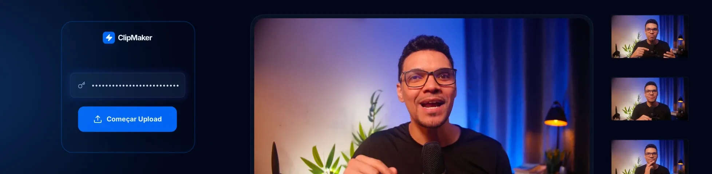

<p align="center"></p>

# NLW Operator - Iniciante


## ClipMaker: Criando seu primeiro app com IA e Tailwind



Projeto desenvolvido durante o evento **NLW Operator** na trilha **Iniciante**.
Você vai aprender fundamentos de programação enquanto constrói um projeto funcional com **HTML**, **CSS (Tailwind)**, **JavaScript**, **Gemini API** e **Cloudinary**, passo a passo.

## 📌 Sobre o projeto

O **ClipMaker** é um app introdutório para praticar desenvolvimento web moderno com foco em IA. A proposta é construir uma aplicação real, simples e evolutiva, entendendo cada etapa do processo:

- Estrutura com HTML
- Estilização com Tailwind CSS
- Lógica e interação com JavaScript
- Integração com IA usando Gemini API
- Upload e gerenciamento de mídia com Cloudinary

## 🚀 Tecnologias

- HTML5
- Tailwind CSS
- JavaScript (ES6+)
- Gemini API
- Cloudinary

## 🎯 Objetivos de aprendizagem

Durante o desenvolvimento deste projeto, você vai praticar:

- Organização de um projeto front-end
- Manipulação do DOM com JavaScript
- Consumo de APIs externas
- Fluxo básico de upload de arquivos
- Boas práticas para construir um app funcional do zero

## 🛠️ Pré-requisitos

Antes de começar, você precisa ter:

- Navegador atualizado (Chrome, Edge ou Firefox)
- Editor de código (VS Code recomendado)
- Conta e chave de API do Gemini
- Conta no Cloudinary

## 🚀 Como executar
1. Abra o arquivo `index.html` no navegador
   (ou use uma extensão como **Live Server** no VS Code).

## 🗃 Estrutura atual

```txt
.
├── index.html
└── README.md
```
---

Desenvolvido com 💜 durante o NLW da Rocketseat
